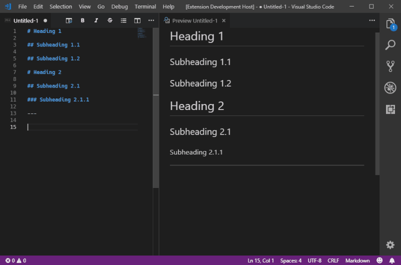

# Markdown AutoTOC

Markdown AutoTOC is a VS Code extension that adds support for inserting an
auto-generated table of contents into the built-in markdown preview using the `[[TOC]]`
syntax.

## Features

The rendered table of contents includes the top two levels of headings by
default (_i.e._ headings prefixed by `#` and `##`) but you can include up to 6
levels of headings if you choose. You can also include an optional title header
for the table of contents itself and override the default HTML class applied to
the `
` container elements for both the table of contents and the title
header.

## Extension Settings

This extension contributes the following settings:

Name                                  | Default Value        | Description
--------------------------------------|----------------------|------------------------------------------------------------------------------------
`markdownAutoTOC.maximumHeadingLevel` | 2                    | The maximum heading level to include in the generated table of contents
`markdownAutoTOC.containerClass`      | toc-container        | The HTML class to apply to the generated `
` for the table of contents.
`markdownAutoTOC.header`              | true                 | Include a heading above the generated table of contents.
`markdownAutoTOC.headerClass`         | toc-container-header | The HTML class to apply to the generated `
` for the table of contents header.
`markdownAutoTOC.headerContent`       | Contents             | The header text to display above the table of contents.

## Known Issues

* The configuration settings are loaded when the extension is activated, so any
  changes made don't take effect until the VS Code window is reloaded or
  restarted.
